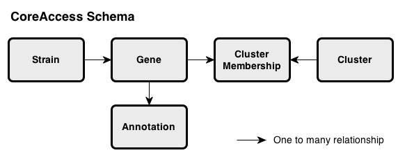

Core Access ReadMe
==================

Description
-----------
Core access is a suite of programs to cluster proteins from multiple genomes and allow querying of these clusters. It is specifically aimed at prokaryotes

Overview
--------
###Clustering###
This is the key process within CoreAccess. It involves taking the predicted genes in each supplied sequence and translating them to produce the putative protein sequences. These are the clustered using the greedy incremental clustering algorithm method of CD-HIT ([cdhit.org](http://cd-hit.org)). Briefly, sequences are first sorted in order of decreasing length. The longest one becomes the representative of the first cluster. Then, each remaining sequence is compared to the representatives of existing clusters. If the similarity with any representative is above a given threshold, it is grouped into that cluster. Otherwise, a new cluster is defined with that sequence as the representative.
###Database###
Once putative proteins have been clustered the information from the clusters is stored in a [Sqlite](http://www.sqlite.org) database. The schema of the database can be seen in the diagram
 

